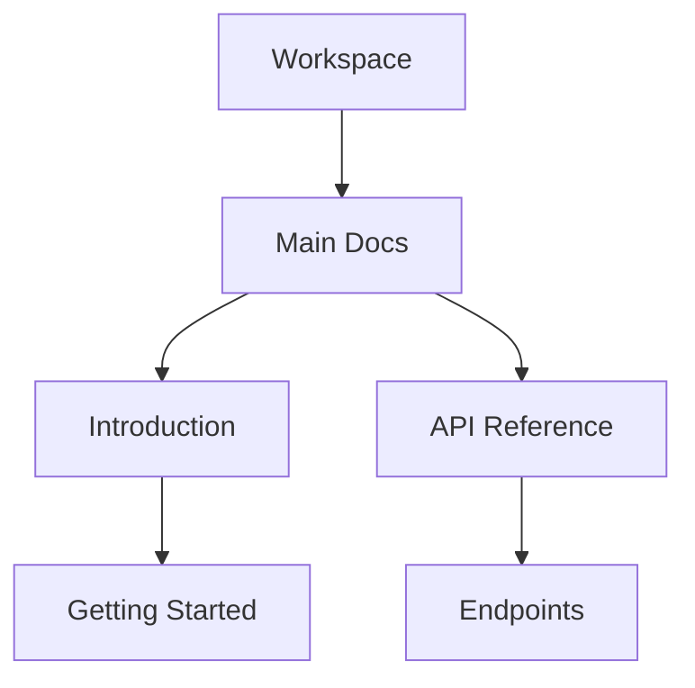

## Overview

dato_igs1 provides powerful features to manage your documentation efficiently. You organize content into structured hierarchies, collaborate in real-time, track changes with version history, and find information quickly using search and tags. These tools ensure your docs stay current and accessible.

<Columns cols={2}>
  <Card title="Document Structuring" icon="layout" href="#document-structuring">
    Build nested pages and sections effortlessly.
  </Card>
  <Card title="Real-time Collaboration" icon="users" href="#collaboration">
    Edit with your team simultaneously.
  </Card>
  <Card title="Version History" icon="git-branch" href="#version-history">
    Revert changes and review revisions.
  </Card>
  <Card title="Search and Tagging" icon="search" href="#search-tagging">
    Locate content with precision.
  </Card>
</Columns>

## Document Structuring and Hierarchy

Create a clear information architecture in dato_igs1. You define pages, subpages, and sections using a simple nesting system. This hierarchy improves navigation and user experience.

<Steps>
  <Step title="Create a New Page" icon="plus">
    Navigate to your workspace and select **New Page**.

    ```bash
    # Example structure in your sidebar
    Docs/
    ├── Introduction
    │   └── Getting Started
    └── API Reference
        └── Endpoints
    ```
  </Step>
  <Step title="Nest Subpages" icon="folder">
    Drag pages into folders or use the **Nest** button to organize content.
  </Step>
  <Step title="Add Sections" icon="hash">
    Use H2 (`##`) and H3 (`###`) headings within pages for internal structure.
  </Step>
</Steps>



<Callout kind="tip">
  Maintain a hierarchy no deeper than three levels to avoid overwhelming users.
</Callout>

## Real-time Collaboration Editing

Invite team members to edit docs simultaneously. Changes appear instantly, with cursors showing who edits what.

<Tabs>
  <Tab title="Invite Collaborators" icon="user-plus">
    Share a page link or add emails via the **Share** button. Set permissions: view, edit, or admin.
  </Tab>
  <Tab title="Live Editing" icon="edit-3">
    See real-time updates. Use `@mentions` for notifications.

    <CodeGroup tabs="Markdown,Rich Text">
    ````markdown
    ## Team Update

    @alice Review this section.
    @bob Add examples here.
    ````
    ````
    <p>Team Update</p>
    <p><mention>@alice</mention> Review this section.</p>
    <mention>@bob</mention> Add examples here.
    ````
    </CodeGroup>
  </Tab>
</Tabs>

## Version History and Revisions

Track every change with automatic version history. You compare versions, restore previous states, and view edit logs.

### Accessing History

1. Open a page.
2. Click **History** in the top-right menu.
3. Select a revision to preview or restore.

<Expandable title="Advanced Revision Workflow" default-open="false">
  Use the API for programmatic access:

  <CodeGroup tabs="cURL,JavaScript">
  ```bash
  curl -H "Authorization: Bearer YOUR_API_KEY" \
       https://api.example.com/docs/page-id/history
  ```
  ```javascript
  const response = await fetch('https://api.example.com/docs/page-id/history', {
    headers: { Authorization: `Bearer ${YOUR_API_KEY}` }
  });
  const history = await response.json();
  ```
  </CodeGroup>
</Expandable>

## Advanced Search and Tagging

Quickly find content across your workspace. Tags categorize docs for better organization.

### Tagging System

Add tags like `api`, `internal`, or `draft` to pages.

<ParamField path="tags" param-type="array" required="false">
  Array of strings for categorization, e.g., `["api", "v1"]`.
</ParamField>

### Search Features

- Full-text search with fuzzy matching.
- Filter by tags, authors, or dates.

| Feature          | Description                          |
|------------------|--------------------------------------|
| Basic Search     | Matches titles and content.          |
| Tag Filter       | `tag:api` finds all API docs.        |
| Advanced Query   | `"exact phrase" tag:internal`.       |

<Callout kind="info">
  Pro tip: Combine tags with search for precise results, like `authentication tag:sdk`.
</Callout>