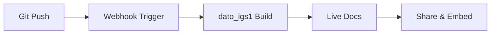

## Overview

Connect dato_igs1 to your favorite tools to streamline workflows. Integrate with version control systems like GitHub and GitLab for automatic documentation updates. Set up webhooks to trigger builds on commits, import content from platforms like Notion or Confluence, and embed external resources such as videos or charts directly into your docs. These integrations save time and keep your documentation in sync with your codebase.

<Callout kind="tip">
  Start with version control integration—it's the most common setup and enables CI/CD pipelines for docs.
</Callout>

## Key Integrations

Use these ready-to-go connections to supercharge your documentation.

<Columns cols={3}>
  <Card title="Version Control" icon="git-branch" href="#version-control">
    Sync docs with GitHub, GitLab, or Bitbucket repos.
  </Card>
  <Card title="Webhooks" icon="zap" href="#webhooks">
    Trigger updates on events like pushes or PRs.
  </Card>
  <Card title="Content Import" icon="upload" href="#import-content">
    Pull in pages from Notion, Google Docs, or Markdown files.
  </Card>
</Columns>

## Version Control Integration

Link your dato_igs1 space to a Git repository for seamless sync. Changes pushed to your repo automatically update your live documentation.

<Steps>
  <Step title="Create Repository Connection" icon="git-branch">
    In your dato_igs1 dashboard, navigate to Settings {`>`} Integrations {`>`} Git.

    Select your provider and authorize access.
  </Step>
  <Step title="Configure Branch Sync" icon="settings">
    Specify the branch (e.g., `main`) and doc root path (e.g., `/docs`).

````markdown
```yaml
# .gitignore example
docs/build/
node_modules/
```
````
  </Step>
  <Step title="Test Sync" icon="play">
    Push a change to your repo and verify it appears in dato_igs1 within 60 seconds.
  </Step>
</Steps>

## Webhook Configuration

Set up webhooks to notify dato_igs1 of external events. Use the endpoint `https://api.dato_igs1.com/v1/webhooks/docs/{space_id}`.

<Tabs>
  <Tab title="GitHub" icon="github">
    In your repo settings, add a webhook with this payload URL.

    <CodeGroup tabs="Payload,Secret">
````json
{
  "action": "pushed",
  "ref": "refs/heads/main",
  "repository": {
    "full_name": "your-org/your-repo"
  }
}
````
````bash
# Verify with HMAC SHA-256
echo -n 'payload' | openssl dgst -sha256 -hmac $YOUR_WEBHOOK_SECRET
````
    </CodeGroup>
  </Tab>
  <Tab title="GitLab" icon="git-branch">
    Go to Settings {`>`} Webhooks and enter the dato_igs1 URL.

    Enable triggers for Push events and add a secret.
  </Tab>
</Tabs>

<ParamField path="space_id" param-type="string" required="true">
  Your dato_igs1 space identifier from the dashboard.
</ParamField>

## Import Content from Platforms

Bring existing content into dato_igs1 without manual copy-paste.

### From Notion
Export pages as Markdown, then upload via the API or dashboard importer.

<CodeGroup tabs="cURL,JavaScript">
````bash
curl -X POST https://api.dato_igs1.com/v1/import \
  -H "Authorization: Bearer YOUR_API_KEY" \
  -F "file=@notion-export.md"
````
````javascript
const formData = new FormData();
formData.append('file', notionExportBlob);

fetch('https://api.dato_igs1.com/v1/import', {
  method: 'POST',
  headers: { 'Authorization': `Bearer ${YOUR_API_KEY}` },
  body: formData
});
````
</CodeGroup>

### From Other Sources
Supports CSV, MD, HTML. Use the bulk import tool for large migrations.

## Embed External Resources

Embed live content to keep docs dynamic.

````markdown
```html
<!-- YouTube Video -->
<iframe src="https://www.youtube.com/embed/dQw4w9WgXcQ" width="560" height="315"></iframe>

<!-- Figma -->
<iframe src="https://www.figma.com/embed?embed_host=share&url=https://www.figma.com/file/abc" width="600" height="450"></iframe>
```
````

<Callout kind="alert">
  Embeds load asynchronously. Test in preview mode to ensure compatibility.
</Callout>

## Automation Workflow

Visualize a typical Git-to-docs pipeline:



Start with GitHub integration today to automate your docs updates. For advanced setups, check the [API reference](/api-reference).